# 使用手冊 Manual Guide

## 介紹 Introduction

本專案旨在設計和開發一個自動實體標注平台，目標是提供一個便利、高效且直觀的工具，以數字化的優勢幫助文學的研究與分析，幫助學術研究者或是對中文文章感興趣的個人用戶更快捷地對與其研究相關的中文文本進行分析。

本平台主要利用中研院的[CKIP 模型](https://ckip.iis.sinica.edu.tw/resource)自動識別使用者輸入的文字或上傳的文件中的實體 (Entity)，例如人名、地名、數字等，大量節省用戶手動識別的時間。亦允許使用者手動標記和刪除實體，支援手動劃分實體群組 (Entity group) 和別名 (Entity alias)，提供多種類型的圖表視覺化以顯示實體出現的頻率，並支持數據導出等功能。

## 下載使用 Download and Use

請前往以下網址，依照指示下載並使用：
https://github.com/hkust-lib-ds/P001-PUBLIC_Chinese-NER-Tool

## 入門指南 Getting Started

### 專業名詞中英對譯

| 英文            | 中文     | 詳細釋義                                   | 例子                                               |
| :-------------- | :------- | :----------------------------------------- | :------------------------------------------------- |
| Entity instance | 實體實例 | 被劃分為某個實體類別的詞                   | 小明，香港                                         |
| Entity class    | 實體類別 | 定義某一類詞語                             | 人名，地名，時間                                   |
| Entity group    | 實體群組 | 把不同的實體實例自訂為實體群組以作合併研究 | 西遊記主角（唐僧，孫悟空，豬八戒，沙和尚，白龍馬） |
| Entity alias    | 實體別名 | 把指向同一事物的實體合併                   | 陳小明（小明，阿明，陳小明）                       |

### 介面概覽

### 平台功能

#### 1. 自動識別及標注實體 Entities Auto Annotation

##### 1.1 輸入文本 Import data via inputting/pasting text in the textarea

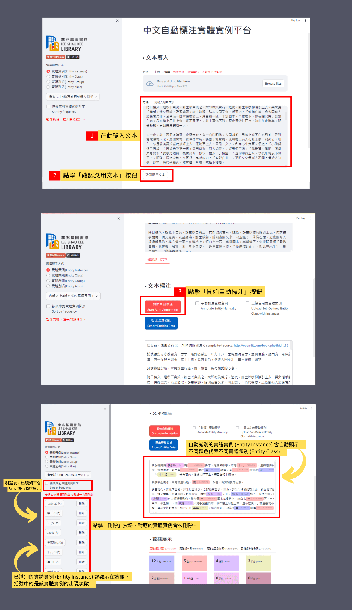

1. 把文本放進文本框。
2. 點擊「確認應用文本」。
3. 下滑頁面，點擊「開始自動標注 Start Auto-Annotation」。

-   自動識別的實體實例 (Entity Instance) 會自動顯示。 不同顏色代表不同實體類別。
-   已識別的實體實例會顯示在側邊欄 ​。 括號中的是該實體實例 (Entity Instance) 的出現次數。
-   在側邊欄，點擊「刪除」按鈕，對應的實體實例會被刪除。
-   剔選「按頻率對實體實例排序 Sort by frequency」，實體實例 (Entity Instance) 會依照出現頻率從大到小的順序展示。

<h4 id="1-2"></h4>

##### 1.2 上傳文件 Import data via uploading txt file(s)

_除了文件上傳與[圖表展示](#6-4)略有不同，其餘流程與「1.1 輸入文本」一樣_

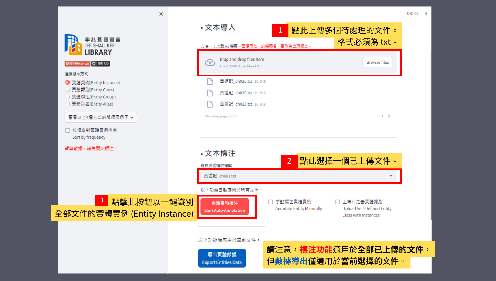

1. 點「Browse files」可上傳一個或以上的 txt 文檔。
2. 可以選擇要處理的檔案。
3. 點擊「開始自動標注 Start Auto-Annotation」。

-   請注意，**標注功能**適用於全部已上傳的文件，但**數據導出**僅適用於當前選擇的文件。

#### 2. 手動標記和刪除實體 Manually Add and Delete Entity Instance

本平台允許使用者手動標記和刪除實體 (Entity Instance)。這對於那些無法透過自動識別準確標記的實體，或需要對特定實體進行調整和修正的使用者來說非常有用。使用者可以透過簡單的操作來增加、修改或刪除實體標記，以確保準確性和完整性。

<h4 id="2-1"></h4>

##### 2.1 手動新增實體實例 Manually Add Entity Instance

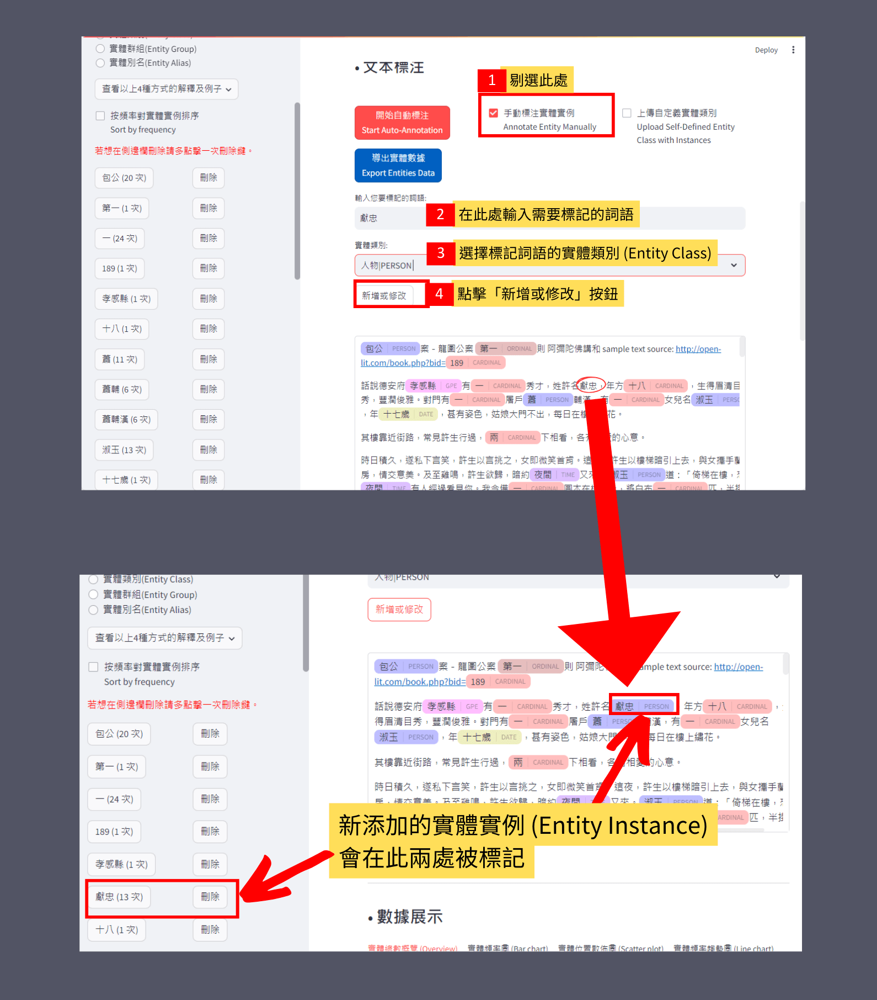

1. 剔選「手動標注實體實例 Annotate Entity Manually」。
2. 在此處輸入需要標記的詞語。
3. 選擇標記詞語的實體類別 (Entity Class)。
4. 點擊「新增或修改」。

-   新添加的實體實例 (Entity Instance) 會在此兩處被標記 (如上圖)。

##### 2.2 手動刪除實體實例 Manually Delete Entity Instance

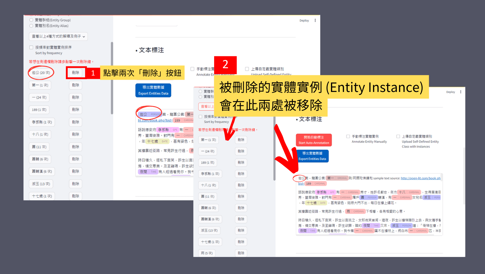

1. 在側邊欄，點擊「刪除」按鈕兩次。
2. 被刪除的實體實例 (Entity Instance)會在此兩處被移除 (如上圖)。

#### 3. 實體類別 Entity Class

每個實體實例 (Entity Instance) 可定義為某一類實體類別 (Entity Class)。本平台除了提供 [CKIP 模型的 18 種實體類別 (Entity Class)](https://github.com/ckiplab/ckiptagger/wiki/Entity-Types) (以下表格) 外，也提供自定義實體類別 (Create new Entity Class / Self-Defined Entity Class) 功能。

| Entity Class | 實體類別             | Description                                          |
| ------------ | -------------------- | ---------------------------------------------------- |
| CARDINAL     | 數字                 | Numerals that do not fall under another type         |
| DATE         | 日期                 | Absolute or relative dates or periods                |
| EVENT        | 事件                 | Named hurricanes, battles, wars, sports events, etc. |
| FAC          | 設施                 | Buildings, airports, highways, bridges, etc.         |
| GPE          | 行政區               | Countries, cities, states                            |
| LANGUAGE     | 語言                 | Any named language                                   |
| LAW          | 法律                 | Named documents made into laws                       |
| LOC          | 地理區               | Non-GPE locations, mountain ranges, bodies of water  |
| MONEY        | 金錢                 | Monetary values, including unit                      |
| NORP         | 民族、宗教、政治團體 | Nationalities or religious or political groups       |
| ORDINAL      | 序數                 | “first”, “second”                                    |
| ORG          | 組織                 | Companies, agencies, institutions, etc.              |
| PERCENT      | 百分比率             | Percentage (including “%”)                           |
| PERSON       | 人物                 | People, including fictional                          |
| PRODUCT      | 產品                 | Vehicles, weapons, foods, etc. (Not services)        |
| QUANTITY     | 數量                 | Measurements, as of weight or distance               |
| TIME         | 時間                 | Times smaller than a day                             |
| WORK_OF_ART  | 作品                 | Titles of books, songs, etc.                         |

##### 3.1 按實體類別篩選 Filter by Entity Class

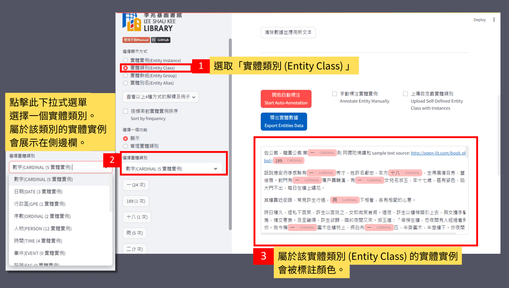

1. 在側邊欄，點擊「實體類別(Entity Class)」。
2. 點擊下方的下拉式選單，選擇一個實體類別 (Entity Class)。 屬於該類別的實體實例 (Entity Instance) 會展示在側邊欄。
3. 在主畫面，屬於該實體類別 (Entity Class) 的實體實例 (Entity Instance) 會被標註顏色，向下滑的圖表視覺化部份也會只展示該實體類別 (Entity Class) 的數據。

##### 3.2 手動創建一個新的實體類別 Create new Entity Class manually

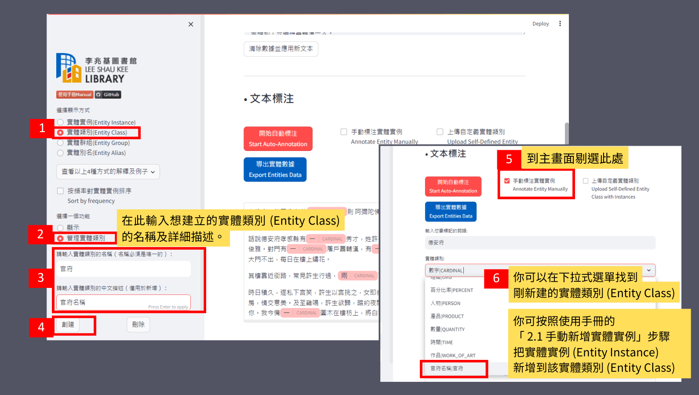

1. 在側邊欄，點擊「實體類別 (Entity Class) 」。
2. 點擊「管理實體類別」。
3. 輸入想建立的實體類別 (Entity Class) 的名稱及詳細描述。
4. 點擊「創建」。新建立的實體類別 (Entity Class) 會被加入到實體類別清單。
5. 在主畫面，剔選「手動標注實體實例 Annotate Entity Manually」。
6. 你可以在此下拉式選單找到剛新建的實體類別 (Entity Class)。接著，你可按照[「2.1 手動新增實體實例」](#2-1)的步驟把實體實例 (Entity Instance) 新增到該實體類別 (Entity Class)。

##### 3.3 導入 CSV 檔批量創建實體類別及其實體實例 Create new Entity Class with Entity Instances by importing csv

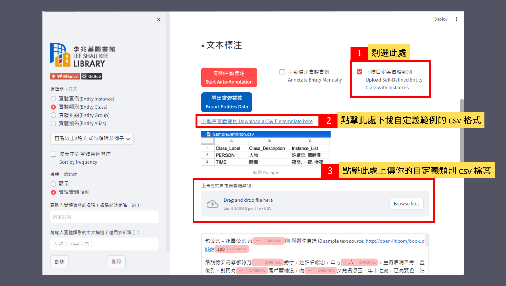

1. 在主畫面，剔選「上傳自定義實體類別 Upload Self-Defined Entity Class with Instances」。
2. 你可點擊「下載自定義範例 Download a CSV file template here」下載範例格式。
3. 點擊下方的「Browse files」上傳你的自定義類別 csv 檔案。

#### 4. 實體群組 Entity Group

除了單獨標記實體外，本平台還支持將實體實例 (Entity Instance) 分組 (Group)。使用者可以根據實體之間的相關性和共同特徵，將它們劃分到不同的組別。這有助於使用者更好地理解實體之間的關係，並從更高層次分析和研究這些實體。

| 英文         | 中文     | 詳細釋義                                   | 例子                                               |
| :----------- | :------- | :----------------------------------------- | :------------------------------------------------- |
| Entity group | 實體群組 | 把不同的實體實例自訂為實體群組以作合併研究 | 西遊記主角（唐僧，孫悟空，豬八戒，沙和尚，白龍馬） |

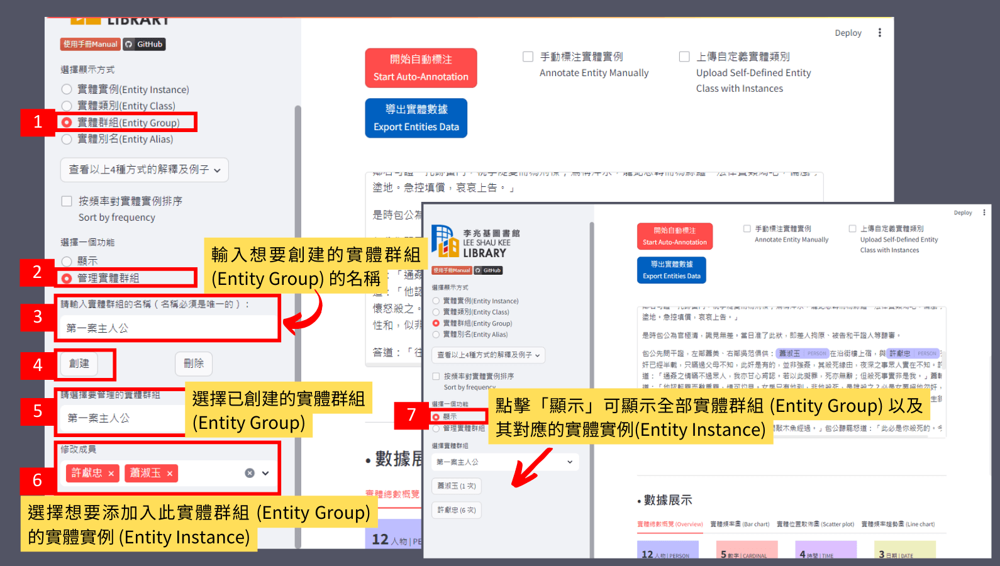

1. 在側邊欄，點擊「實體群組(Entity Group)」。
2. 點擊「管理實體群組」。
3. 輸入想要創建的實體群組 (Entity Group) 的名稱。
4. 點擊「創建」。
5. 在下拉式選單，選擇已創建的實體群組 (Entity Group)。
6. 選擇想要添加入此實體群組 (Entity Group) 的實體實例 (Entity Instance)。
7. 在側邊欄，點擊「顯示」。在下拉式選單可顯示全部已創建的實體群組 (Entity Group) 以及其對應的實體實例 (Entity Instance)。在主畫面，向下滑的圖表視覺化部份也會只展示該實體群組 (Entity Group) 的數據。

#### 5. 實體別名 Entity Alias

本平台還支持將指向同一事物的實體實例 (Entity Instance) 合併為一個別名 (Alias)，並相應地查看它們的頻率，這有助清楚地展示數據中的重複概念，從而更好地分析實體之間的關係和分布情況。

| 英文         | 中文     | 詳細釋義                 | 例子                         |
| :----------- | :------- | :----------------------- | :--------------------------- |
| Entity alias | 實體別名 | 把指向同一事物的實體合併 | 陳小明（小明，阿明，陳小明） |

1. 在側邊欄，點擊「實體別名(Entity Alias)」。
2. 點擊「管理實體別名」。
3. 輸入想要創建的實體別名 (Entity Alias) 的名稱。
4. 選擇已創建實體別名的實體類別。
5. 點擊「創建」。
6. 選擇已創建的實體別名 (Entity Alias)。
7. 選擇想要添加入此實體別名 (Entity Alias) 的實體實例 (Entity Instance)。
8. 被添加入當前實體別名 (Entity Alias) 的實體實例 (Entity Instance) 在右方主畫面。
9. 在側邊欄，點擊「顯示」可顯示全部實體別名 (Entity Alias) 以及其對應的實體實例 (Entity Instance)。在主畫面，圖表視覺化部份也會只展示該實體別名 (Entity Alias) 的數據。

#### 6. 圖表視覺化 Visualization

為了更直觀地展示實體的出現頻率和分布情況，本平台提供了圖表視覺化功能。使用者可以透過主畫面下方的圖表來查看實體在文章中的出現頻率和位置。這有助於使用者更好地理解文章中詞語的使用。

##### 6.1 實體總數概覽 (Overview)

在主畫面，下滑至「數據展示」欄目的「實體總數概覽 (Overview)」，不同實體類別 (Entity Class) 被標記為不同顏色的色塊。其中的數字代表此實體類別 (Entity Class) 內的實體實例 (Entity Instance) 數量。

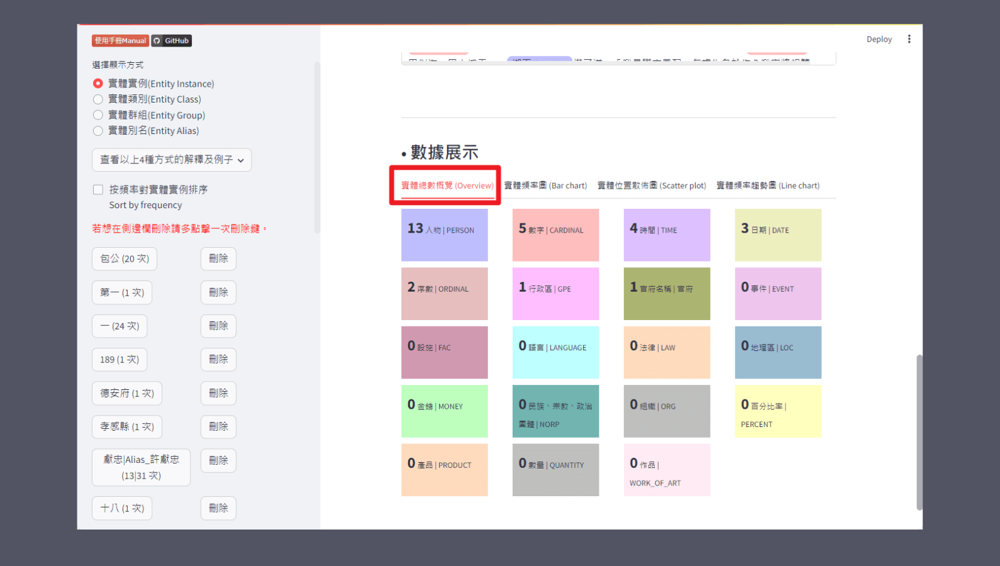

##### 6.2 實體頻率圖 (Bar chart)

點擊「實體頻率圖 (Bar chart)」，以棒形圖 (Bar chart) 顯示實體出現的次數。

可以在側邊欄點選「實體實例(Entity Instance)」、「實體類別(Entity Class)」、「實體群組(Entity Group)」或「實體別名(Entity Alias)」，此棒形圖 (Bar chart) 會隨側邊欄的設定而改變。

點擊「實體頻率圖 (Bar chart)」，以棒形圖 (Bar chart) 顯示實體出現的次數。

若勾選「將實體別名應用於頻率條形圖」，相同實體別名 (Entity Alias) 下的所有實體實例 (Entity Instance) 將會合併計數，棒形圖上顯示的次數為該實體別名 (Entity Alias) 的總和。

_註：棒形圖 (Bar chart) 只顯示頻率排名前十五 (top 15) 的實體實例。_

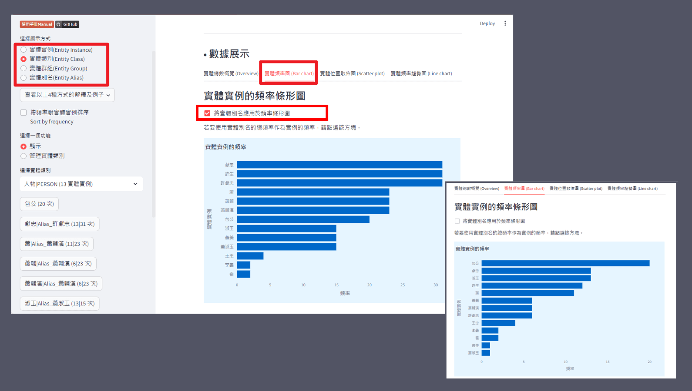

##### 6.3 實體位置散佈圖 (Scatter plot)

點擊「實體位置散佈圖 (Scatter plot)」，以散佈圖 (Scatter plot) 顯示頻率排名前十五的實體實例 (Entity Instance) 的在文本出現的位置。

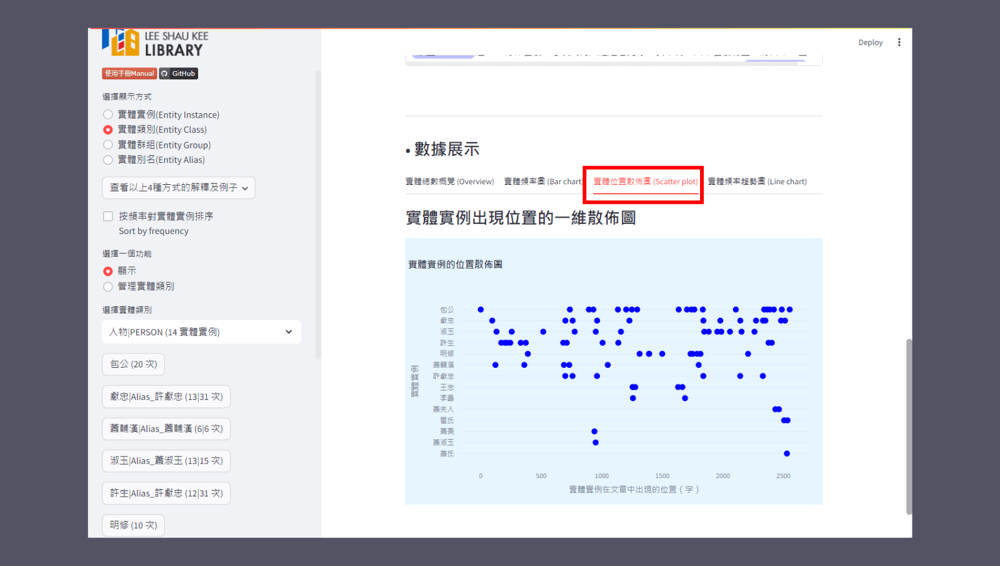

<h4 id="6-4"></h4>

##### 6.4 實體頻率趨勢圖 (Line chart)

此圖表僅適用於當[上傳了多於一個文本](#1-2)時使用。

點擊「實體頻率趨勢圖 (Line chart)」，選擇一個詞語 (i.e. 實體實例 Entity Instance) ，圖表會顯示該詞在不同文檔中出現的頻率趨勢。例如，當您想了解某個角色在不同章節中出現的頻率情況時，您可以查看這個圖表來觀察其趨勢變化。

_註：文件順序按照首字母排序，並非上傳順序。若想自定順序請在文件名開頭加上數字。例如，「1 第一則」,「2 第二則」 , etc._

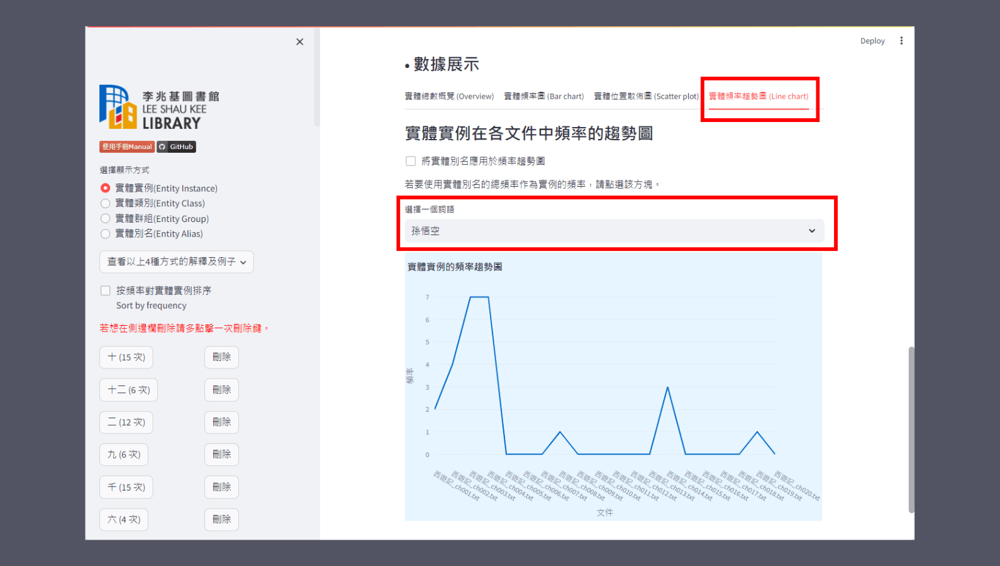

#### 7. 數據導出 Data Export

本平台支持實體數據導出功能。使用者可以將標記的實體資料匯出為常見的資料格式（CSV），以便在其他工具或平台上進行進一步處理和分析。

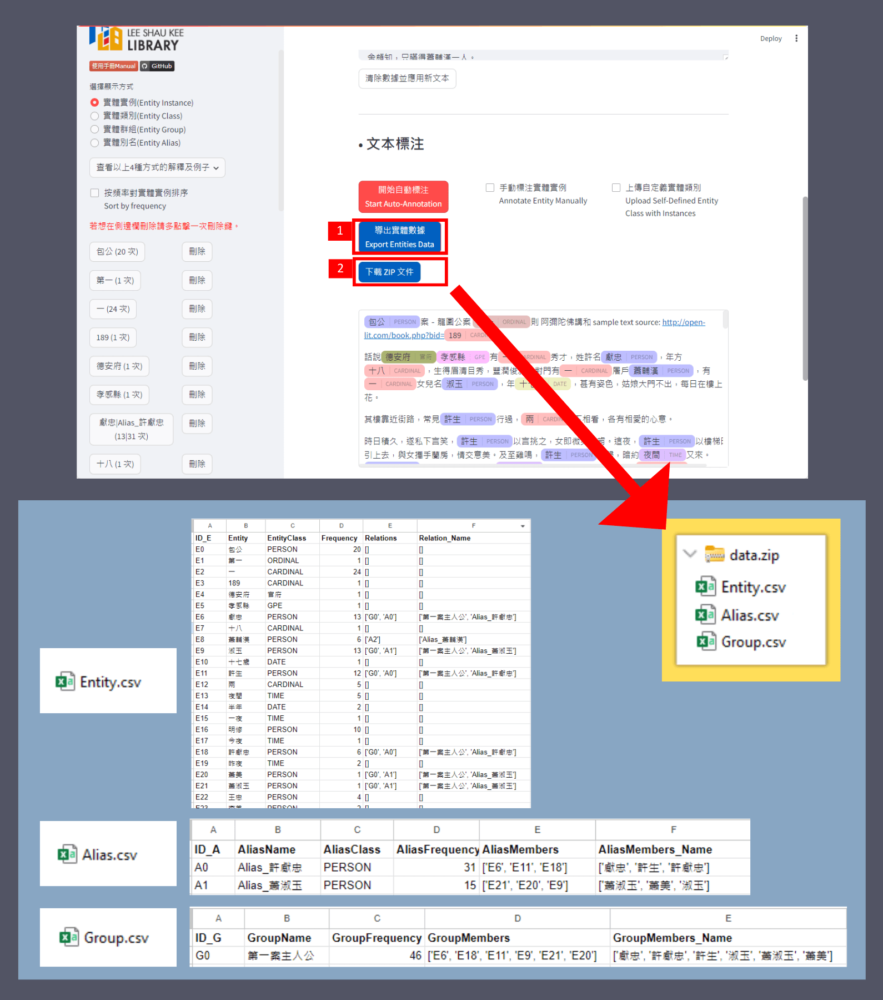

1. 點擊「導出實體數據 Export Entities Data」。
2. 然後，一個新按鈕「下載 ZIP 文件」將會出現，點擊此按鈕。
3. 一個名為 `data.zip` 的檔案會自動下載到您的電腦上。

`data.zip`內會有三個 csv 檔，每個 csv 檔中的每一行都包含一個唯一的 ID，請看上圖查看例子。

-   `Entity.csv`
    -   ID_E
    -   Entity
    -   EntityClass
    -   Frequency
    -   Relations
    -   Relation_Name
-   `Alias.csv`
    -   ID_A
    -   AliasName
    -   AliasClass
    -   AliasFrequency
    -   AliasMembers
    -   AliasMembers_Name
-   `Group.csv`
    -   ID_G
    -   GroupName
    -   GroupFrequency
    -   GroupMembers
    -   GroupMembers_Name
